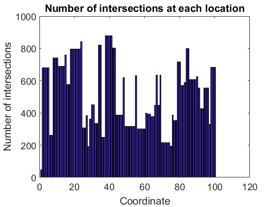
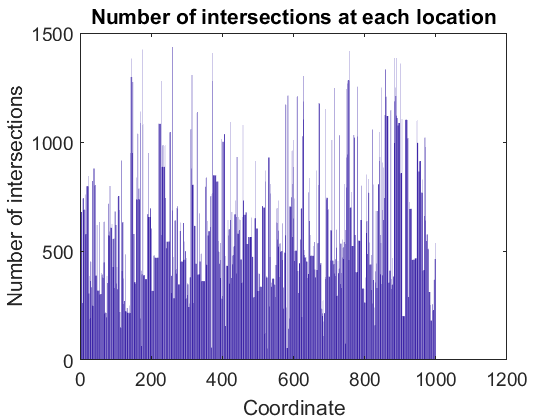
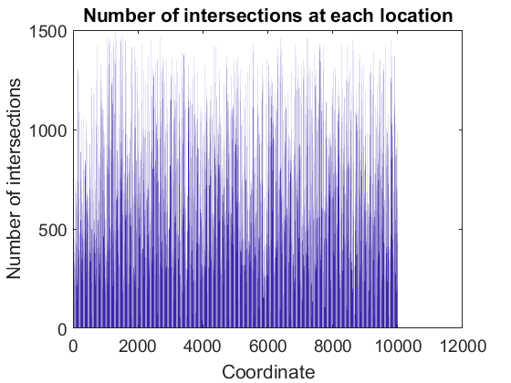

# Computational-Genomics
Group 2 HWs
## brute force solution with MATLAB(Bo)
- Import h5 file and extract the genome matrix
- Loop every line and every location to find all intersections
- Find the intersections line names for each location
- Plot number of intersections across the genome

##chunking with python(Max)
-import table via chunking and cycle through line
-loop every line and every location to find distribution of intersection alleles
-find quantity of intersections per line
-plot number of intersections per line
-plot distribution of intersections per line
